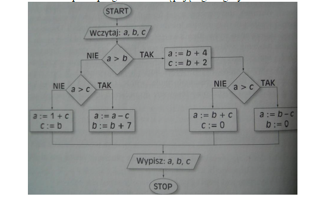
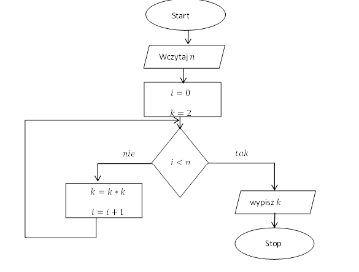

# Podstawy Programowania w języku C++
## Przykłady

### Zad. 1. 

Napisać algorytm/program sprawdzający, które z 99 wprowadzonych z klawiatury liczb jest podzielnych przez 5.
### Zad. 2. 

Napisać algorytm/program sprawdzający, czy wprowadzona z klawiatury
liczba jest pierwsza.

### Zad. 3. 
Napisać algorytm/program, który wyznacza iloczyn 246...2n dla dowolnie ustalonego nN - podanego przez użytkownika.

### Zad. 4. 
Napisać program, który po wprowadzeniu liczby n wypisze sumę liczb parzystych mniejszych od n.

### Zad. 5. 

Napisać algorytm/program rozwiązujący równanie 𝑎𝑥 + 𝑏 = 1 po podaniu
przez użytkownika liczb 𝑎 i 𝑏.
### Zad. 6. 

Napisać algorytm/program wyznaczający wartość 𝑎𝑏 dla wprowadzonych
niezerowych liczb całkowitych/naturalnych 𝑎 i 𝑏.
### Zad. 7. 

Napisać algorytm/program który pozwoli na wprowadzenie 5 liczb oraz
wypisze sumę wprowadzonych liczb dodatnich i ich ilość.
### Zad. 8. 

Napisać program do następującego algorytmu
### Zad. 9. 

Dane jest n naturalne. Napisać algorytm/program, który wyznaczy n
początkowych wyrazów ciągu określonego następująco: 𝑎1 = 2, 𝑎𝑘+1 = 1 + 2𝑎𝑘 dla
𝑘 ≥ 2.
### Zad. 10. 

Napisać program rozwiązujący równanie 𝑎𝑥2 + 𝑏𝑥 = 1 po podaniu przez
użytkownika liczb 𝑎 i 𝑏.
### Zad. 11. 

Napisać program do następującego algorytmu:
 
### Zad. 12. 

Napisać program do następującego algorytmu:
 
### Zad. 13. 

Napisać program/algorytm sumujący podawane przez użytkownika liczby do momentu podania przez niego liczby 0, a następnie wypisujący otrzymaną sumę i ilość podanych liczb (włącznie z zerem/niezerowych).
### Zad. 14. 

Napisać program/algorytm wypisujący wszystkie dzielniki podanej przez użytkownika liczby.
### Zad. 15. 

Napisać program/algorytm wyznaczający najmniejszy wspólny dzielnik.
### Zad. 16. 

Napisać program/algorytm wyznaczający największy wspólny dzielnik.
### Zad. 17. 

Napisać program/algorytm wyznaczający najmniejszą wspólną wielokrotność
Materiały wyłącznie dla studentów I roku Matematyki UR – studia licencjackie w
roku akademickim 2022/23
### Zad. 18. 

Napisać program/algorytm wyznaczający wszystkie czynniki pierwsze podanej liczby
### Zad. 19. 

Liczbami bliźniaczymi nazywamy dwie liczby pierwsze 𝑝 i 𝑞 takie, że 𝑞=𝑝+2. Napisać program/algorytm znajdujący pierwszych 20 par liczb bliźniaczych.
### Zad. 20. 

Napisać program/algorytm znajdujący pięć najmniejszych liczb naturalnych 𝑛, takich, że liczba 𝑛2−1 jest iloczynem trzech różnych liczb pierwszych.
### Zad. 21. 

Napisać program/algorytm sprawdzający, czy podane dwie liczby są pierwsze.
### Zad. 22. 

Napisać program/algorytm liczący sumę cyfr podanej liczby naturalnej.
### Zad. 23. 

𝑛-cyfrowa liczb aArmstronga to liczba naturalna równa sumie 𝑛-tych potęg swoich cyfr. Napisać program/algorytm wyznaczający wszystkie dwucyfrowe (𝑘-cyfrowe) liczby Armstronga.
### Zad. 24. 

Napisać program/algorytm wyznaczający pole prostokąta o podanych bokach.
### Zad. 25. 

Napisać program/algorytm sprawdzający, czy dwa okręgi o podanych środkach i promieniach mają punkty wspólne.
